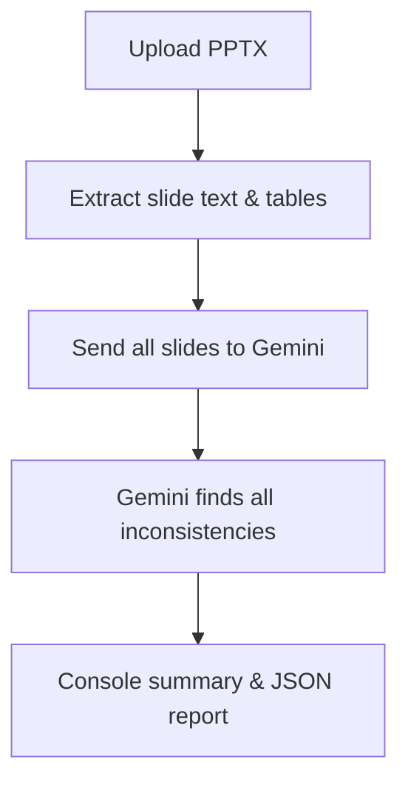

# 🚀 Noogat Deck Consistency Checker

**AI-powered, lightning-fast, and brutally honest about your slides.**

---

## What is Noogat?
Noogat is your AI sidekick for PowerPoint decks. It scans your entire presentation and instantly flags any factual, logical, or numeric inconsistencies—so you never get caught with a "10 + 20 + 30 = 80" moment again.

- **Input:** `.pptx` file (PowerPoint deck)
- **Output:** Beautiful, color-coded console summary and a detailed JSON report of all detected issues, with slide numbers and crisp explanations.
- **Powered by:** Google Gemini 2.5 Pro (or Flash) LLM

---

## ✨ Features
- **Zero-effort deck analysis:** Just point to your PPTX, and Noogat does the rest.
- **AI-driven cross-slide checks:**
  - Contradictory numbers, facts, or claims
  - Percentage sum issues (e.g., market shares not adding up)
  - Timeline/date mismatches
  - Duplicate or conflicting statements
- **Crisp, data-focused reporting:**
  - Each issue is flagged with slide numbers, a direct data flag, and a brief explanation
  - Issues are classified by type (sum, contradiction, timeline, etc.)
  - Serial numbers for easy reference
- **Works offline (except for Gemini API calls)**
- **Beginner-friendly CLI**

---

## 🖼️ How It Works


---

## 🛠️ Setup
1. **Python 3.10+ required**
2. **Get a Google Gemini API key:** [Get your free key here](https://aistudio.google.com/app/apikey)
3. **Install dependencies:**
   ```bash
   python -m venv .venv
   ./.venv/Scripts/Activate.ps1  # on Windows PowerShell
   pip install -r requirements-win.txt
   # Or, for minimal core:
   pip install -r requirements-core.txt
   pip install python-pptx Pillow==9.5.0
   ```
4. **Set your API key:**
   - Recommended: `setx GOOGLE_API_KEY "YOUR_KEY_HERE"` (then restart your shell)
   - Or edit `creds.py` and set `GOOGLE_API_KEY = "YOUR_KEY_HERE"`

---

## 🚦 Usage
1. **Place your deck:**
   - Default: `place_ppt_here/NoogatAssignment.pptx`
   - Or use `--pptx path/to/your.pptx`
2. **Run the checker:**
   ```bash
   python main.py --pptx place_ppt_here/NoogatAssignment.pptx --pretty
   ```
   - Add `--output report.json` to save a JSON report
   - Use `--max-slides N` to limit slides analyzed
   - Use `--model gemini-2.5-pro` or `--model gemini-2.5-flash` as needed

**Full CLI:**
```bash
python main.py \
  [--pptx PATH_TO_PPTX] \
  [--max-slides N] \
  [--output report.json] \
  [--pretty] \
  [--model gemini-2.5-pro]
```

---

## 📊 Output Example
- **Console summary:**
  - Table with serial number, error type, slides involved, and a crisp flag + explanation
- **JSON report:**
  - All issues, with slide references and explanations, for further analysis or sharing

---

## 🧠 How Noogat Thinks (Under the Hood)
1. **Extracts all text (and tables) from each slide**
2. **Sends the entire deck to Gemini in one go**
3. **Gemini analyzes for cross-slide contradictions, sum errors, timeline issues, and more**
4. **Noogat parses the AI's response, classifies each issue, and presents it in a human-friendly way**

---

## 🩹 Troubleshooting & Tips
- **Gemini API key not found?**
  - Make sure you set the environment variable or edit `creds.py`.
- **No issues detected, but you expect some?**
  - Check that your slides have clear, extractable text (not just images)
  - Try with a smaller deck or fewer slides
  - Use `--model gemini-2.5-pro` for best results
- **Want even crisper or more verbose output?**
  - Tweak the prompt in `gemini_client.py` or the formatting in `reporter.py`

---

## 🏆 Why Noogat?
- **Save time:** Instantly catch errors that would take hours to spot manually
- **Impress your audience:** No more embarrassing slide mistakes
- **AI transparency:** See exactly what was flagged, where, and why

---

## 📄 License
MIT


